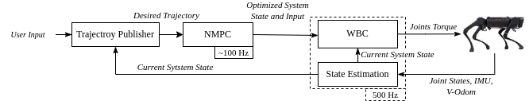
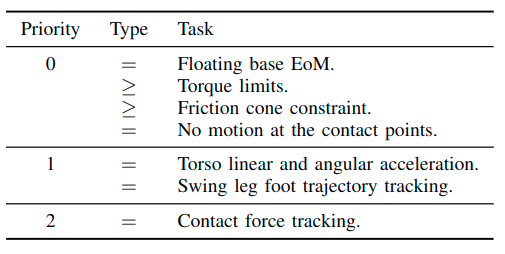

# legged_control

> [!NOTE]
> **This software is not supported anymore! The authors of this software are developing a completely new framework and are not working on this project anymore. Please excuse any inconvenience this might cause.**

> [!NOTE]
> You might be interested in this pipeline with perception, check [legged_perceptive](https://github.com/qiayuanl/legged_perceptive).

## Publications

If you use this work in an academic context, please consider citing the following publications:

    @misc{leggedcontrol,
       title = {{legged_control}:  NMPC, WBC, state estimation, and sim2real framework for legged robots based on OCS2 and ros-controls},
       note = {[Online]. Available: \url{https://github.com/qiayuanl/legged_control}},
       author = {Qiayuan Liao and others}
    }

    @inproceedings{liao2023walking,
      title={Walking in narrow spaces: Safety-critical locomotion control for quadrupedal robots with duality-based optimization},
      author={Liao, Qiayuan and Li, Zhongyu and Thirugnanam, Akshay and Zeng, Jun and Sreenath, Koushil},
      booktitle={2023 IEEE/RSJ International Conference on Intelligent Robots and Systems (IROS)},
      pages={2723--2730},
      year={2023},
      organization={IEEE}
    }

## Introduction

legged_control is an NMPC-WBC legged robot control stack and framework based
on [OCS2](https://github.com/leggedrobotics/ocs2) and [ros-control](http://wiki.ros.org/ros_control).

The advantage shows below:

1. To the author's best knowledge, this framework is probably the best-performing open-source legged robot MPC control
   framework;
2. You can deploy this framework in your A1 robot within a few hours;
3. Thanks to the ros-control interface, you can easily use this framework for your custom robot.

I believe this framework can provide a high-performance and easy-to-use model-based baseline for the legged robot
community.

https://user-images.githubusercontent.com/21256355/192135828-8fa7d9bb-9b4d-41f9-907a-68d34e6809d8.mp4

## Installation

### Source code

The source code is hosted on GitHub: [qiayuanliao/legged_control](https://github.com/qiayuanliao/legged_control).

```
# Clone legged_control
git clone git@github.com:qiayuanliao/legged_control.git
```

### OCS2

OCS2 is a huge monorepo; **DO NOT** try to compile the whole repo. You only need to compile `ocs2_legged_robot_ros` and
its dependencies following the step below.

1. You are supposed to clone the OCS2, pinocchio, and hpp-fcl as described in the documentation of OCS2.
   ```
   # Clone OCS2
   git clone git@github.com:leggedrobotics/ocs2.git
   # Clone pinocchio
   git clone --recurse-submodules https://github.com/leggedrobotics/pinocchio.git
   # Clone hpp-fcl
   git clone --recurse-submodules https://github.com/leggedrobotics/hpp-fcl.git
   # Clone ocs2_robotic_assets
   git clone https://github.com/leggedrobotics/ocs2_robotic_assets.git
   # Install dependencies
   sudo apt install liburdfdom-dev liboctomap-dev libassimp-dev
   ```
2. Compile the `ocs2_legged_robot_ros` package with [catkin tools](https://catkin-tools.readthedocs.io/en/latest/)
   instead of `catkin_make`. It will take you about ten minutes.
   ```
   catkin config -DCMAKE_BUILD_TYPE=RelWithDebInfo
   catkin build ocs2_legged_robot_ros ocs2_self_collision_visualization
   ```
   Ensure you can command the ANYmal as shown in
   the [document](https://leggedrobotics.github.io/ocs2/robotic_examples.html#legged-robot) and below.
   

### Build

Build the source code of `legged_control` by:

```
catkin build legged_controllers legged_unitree_description
```

Build the simulation (**DO NOT** run on the onboard computer)

```
catkin build legged_gazebo
```

Build the hardware interface real robot. If you use your computer only for simulation, you **DO NOT** need to
compile `legged_unitree_hw` (TODO: add a legged prefix to the package name)

```
catkin build legged_unitree_hw
```

## Quick Start

1. Set your robot type as an environment variable: ROBOT_TYPE

```
export ROBOT_TYPE=a1
```

2. Run the simulation:

```
roslaunch legged_unitree_description empty_world.launch
```

Or on the robot hardware:

```
roslaunch legged_unitree_hw legged_unitree_hw.launch
```

3. Load the controller:

```
roslaunch legged_controllers load_controller.launch cheater:=false
```

4. Start the `legged_controller` or `legged_cheater_controller`, **NOTE that you are not allowed to start
   the `legged_cheater_controller` in real hardware!**

```
rosservice call /controller_manager/switch_controller "start_controllers: ['controllers/legged_controller']                   
stop_controllers: ['']
strictness: 0
start_asap: false
timeout: 0.0" 
```

Or, you can start the controller using `rqt_controller_manager` GUI:

```
sudo apt install ros-noetic-rqt-controller-manager
rosrun rqt_controller_manager rqt_controller_manager
```

5. Set the gait in the terminal of `load_controller.launch`, then use RViz (you need to add what you want to display by
   yourself) and control the robot by `cmd_vel` and `move_base_simple/goal`:


### Note

- **THE GAIT AND THE GOAL ARE COMPLETELY DIFFERENT AND SEPARATED!**  You don't need to type stance while the robot is
  lying on the ground **with four foot touching the ground**; it's completely wrong since the robot is already in the
  stance gait.
- The target_trajectories_publisher is for demonstration. You can combine the trajectory publisher and gait command into
  a very simple node to add gamepad and keyboard input for different gaits and torso heights and to start/stop
  controller (by ros service).

## Framework

The system framework diagram is shown below.



- The robot torso's desired velocity or position goal is converted to state trajectory and then sent to the NMPC;
- The NMPC will evaluate an optimized system state and input.
- The Whole-body Controller (WBC) figures out the joint torques according to the optimized states and inputs from the
  NMPC.
- The torque is set as a feed-forward term and is sent to the robot's motor controller.
  Low-gain joint-space position and velocity PD commands are sent to the robot's motors to reduce the shock during foot
  contact and for better tracking performance.
- The NMPC and WBC need to know the current robot state, the base orientation, and the joint state, all obtained
  directly from the IMU and the motors. Running in the same loop with WBC, a linear Kalman filter[1] estimates the base
  position and velocity from base orientation, base acceleration, and joint foot position measurements.

## Module

The main module of the entire control framework is NMPC and WBC, and the following is only a very brief introduction.

### NMPC

The NMPC part solves the following optimization problems at each cycle through the formulation and solving interfaces
provided by OCS2:

$$
\begin{split}
\begin{cases}
\underset{\mathbf u(.)}{\min} \ \ \phi(\mathbf x(t_I)) + \displaystyle \int_{t_0}^{t_I} l(\mathbf x(t), \mathbf u(t),
t) \, dt \\
\text{s.t.} \ \ \mathbf x(t_0) = \mathbf x_0 \,\hspace{11.5em} \text{initial state} \\
\ \ \ \ \ \dot{\mathbf x}(t) = \mathbf f(\mathbf x(t), \mathbf u(t), t) \hspace{7.5em} \text{system flow map} \\
\ \ \ \ \ \mathbf g_1(\mathbf x(t), \mathbf u(t), t) = \mathbf{0} \hspace{8.5em} \text{state-input equality
constraints} \\
\ \ \ \ \ \mathbf g_2(\mathbf x(t), t) = \mathbf{0} \hspace{10.5em} \text{state-only equality constraints} \\
\ \ \ \ \ \mathbf h(\mathbf x(t), \mathbf u(t), t) \geq \mathbf{0} \hspace{8.5em} \text{inequality constraints}
\end{cases}\end{split}
$$

For this framework, we defined system state $\mathbf{x}$ and input $\mathbf{u}$ as:

$$
\begin{equation} \mathbf{x}= [\mathbf{h}_{com}^T, \mathbf{q}_b^T, \mathbf{q}_j^T]^T,
\mathbf{u} = [\mathbf{f}_c^T, \mathbf{v}_j^T]^T \end{equation}
$$

where $\mathbf{h}_{com} \in \mathbb{R}^6$ is the collection of the normalized centroidal momentum,
$\mathbf{q}=[\mathbf{q}_b^T, \mathbf{q}_j^T]^T$ is the generalized coordinate. $\mathbf{f}_c \in \mathbb{R}^{12}$
consists of contact forces at four contact points, i.e., four ground reaction forces of the foot. $\mathbf{q}_j$ and
$\mathbf{v}_j$ are the joint positions and velocities.
While the cost function is simply the quadratic cost of tracking the error of all states and the input, the system
dynamics uses centroidal dynamics with the following constraints:

- Friction cone;
- No motion at the standing foot;
- The z-axis position of the swinging foot satisfies the gait-generated curve.

To solve this optimal control problem, a multiple shooting is formulated to transcribe the optimal control problem to a
nonlinear program (NLP) problem, and the NLP problem is solved using Sequential Quadratic Programming (SQP). The QP
subproblem is solved using HPIPM. For more details [2, 3]

### WBC



WBC only considers the current moment. Several tasks are defined in the table above. Each task is the equality
constraints or inequality constraints on decision variables. The decision variables of WBC are:

$$
\mathbf{x}_{wbc} = [\ddot{\mathbf{q}}^T, \mathbf{f}_c^T, \mathbf{\tau}^T]^T
$$

where $\ddot{\mathbf{q}}$ is acceleration of generalized coordinate, $\mathbf{\tau}$ is the joint torque. The WBC solves
the QP problem in the null space of the higher priority tasks' linear constraints and tries to minimize the slacking
variables of inequality constraints. This approach can consider the full nonlinear rigid body dynamics and ensure strict
hierarchy results. For more details [4].

## Deploy and Develop

### A1 robot

People with ROS foundation should be able to run through simulation and real machine deployment within a few hours. The
following shows some known laboratories that have run through this framework on their own A1 objects. and the time spent
The table below shows the labs successfully deploying this repo in their **real A1**; feel free to open a PR to update
it. (because the code they got at the time was not stable, so the spend time cannot represent the their level).

| Lab        | XPeng Robotics | Unitree | Hybrid Robotics |
|------------|----------------|---------|-----------------|
| Spend Time | 1 day          | -       | 2 hours         |

I recommended to use an external computing device such as NUC to run this control framework. The author uses the 11th
generation of NUC, and the computing frequency of NMPC can be close to 200Hz.

### Your costum rorbots

Deploying this framework to your robot is very simple, the steps are as follows:

- Imitate the `UnitreeHW` class in legged_examples/legged_unitree/legged_unitree_hw
  , inherit `LeggedHW` and implement the `read()` and `write()` functions of the hardware interface;
- Imitate the legged_examples/legged_unitree/legged_unitree_description, write the xarco of the robot and generate the
  URDF file, note that the names of the joint and link need to be the same as legged_unitree_description.

## Reference

[1] T. Flayols, A. Del Prete, P. Wensing, A. Mifsud, M. Benallegue, and O. Stasse, “Experimental evaluation of simple
estimators for humanoid robots,” IEEE-RAS Int. Conf. Humanoid Robot., pp. 889–895, 2017, doi:
10.1109/HUMANOIDS.2017.8246977.

[2] J. P. Sleiman, F. Farshidian, M. V. Minniti, and M. Hutter, “A Unified MPC Framework for Whole-Body Dynamic
Locomotion and Manipulation,” IEEE Robot. Autom. Lett., vol. 6, no. 3, pp. 4688–4695, 2021, doi:
10.1109/LRA.2021.3068908.

[3] R. Grandia, F. Jenelten, S. Yang, F. Farshidian, and M. Hutter, “Perceptive Locomotion through Nonlinear Model
Predictive Control,” (submitted to) IEEE Trans. Robot., no. August, 2022, doi: 10.48550/arXiv.2208.08373.

[4] C. Dario Bellicoso, C. Gehring, J. Hwangbo, P. Fankhauser, and M. Hutter, “Perception-less terrain adaptation
through whole body control and hierarchical optimization,” in IEEE-RAS International Conference on Humanoid Robots,
2016, pp. 558–564, doi: 10.1109/HUMANOIDS.2016.7803330.
